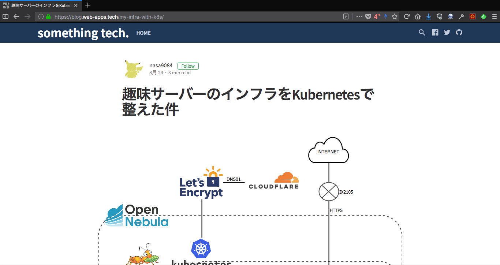

## Building Self-Hosted Kubernetes
### @nasa9084

---

## $ whoami

<div style="float: left;">

</div>

* @nasa9084 @fa[twitter] @fa[github]
* ~~VirtualTech Japan, Inc.~~
* Go, emacs, Kubernetes

+++

### My Home Infra with Kubernetes


https://blog.web-apps.tech

---

# Kubernetes

+++

## Do you know "Kubernetes"?

+++

## Kubernetes is...

* A platform for containerized applications
* An abstraction layer of infrastracture
* An autonomous system
  * Self-Healing
  * Automated deployment/rolling out/scaling
* A CNCF project
* abbreviated: k8s

+++

## K8s can manages...

@ol

- K8s manages containerized apps esp. microservices.
- K8s **IS** an microservice app.
- K8s can manages K8s.

@olend

+++

## K8s on K8s

- Deploy K8s on K8s
- Overcloud K8s is managed by K8s
- How about undercloud k8s?

Note:
* cf. K8s on K8s on OpenStack

+++

# 🤔

+++

## @fa[angle-double-right] Self-Hosted K8s

+++

## What is "Self-Hosted"?

> Self-hosting is the use of a computer program as part of the toolchain or operating system that produces new versions of that same program

-- Wikipedia

+++

## Why Self-Hosted K8s?

1. API driven update/rollbacks
2. Cluster Introspection

+++

### API driven update/rollbacks

Upgrading Kubernetes can be difficult (at least for me, it's difficult!)

@fa[arrow-right] You can use K8s API for self-hosted cluster

Note:
K8sのコンポーネントをちゃんと更新するために、構成管理ツールなどの外部ツールを使わなければならない

+++

### Cluster Introspection

| | not self-hosted | self-hosted |
|:---:|:---|:---|
| log | journalctl | kubectl logs |
| status | systemctl status | kubectl describe |

---

### How to build Self-Hosted K8s

+++

### K8s Components

* kube-apiserver
* kube-scheduler
* kube-controller-manager
* cloud-controller-manager
* etcd
* kubelet
* kube-proxy
* cluster DNS

+++

### How K8s works


+++

### The Level of Self-Hosting


+++

## KEY: static Pod

* Pods managed directly by kubelet
* **WITHOUT** kube-apiserver

``` shell
$ kubelet ----pod-manifest-path=/PATH/TO/MANIFESTS
```

+++

### step 1: prepare nodes


+++

### step 2: bootstrap cluster

bootstrap cluster is deployed using static Pod


+++

### step 3: deploy k8s onto bootstrap

deploy master components using kubectl


+++

### step 4: delete bootstrap cluster


---

## Which one can deploy Self-Hosted Cluster?

| Tool | can |
|:---:|:---:|
| Tectonic | @fa[check] |
| kubeadm | @fa[check]* |
| Magnum | @fa[times] |
| Rancher | @fa[times] |
| kubespray | @fa[times] |

Note:
* kubeadm self-hostedはアルファ
* kubesprayは半self-host
  * 一部static podで動いてる

+++

### How to manage Self-Hosted K8s Cluster?

You can manage K8s cluster via K8s API

* no config management system
* no extra tool

@fa[arrow-right] easy to manage

---

## Summary

* Kubernetes can manage Kubernetes
* It's easy to manage than not self-hosting
  * manage cluster via K8s API
* You can deploy Self-Hosted cluster using...
  * Tectonic
  * kubeadm (not stable)
* May be default in the future

---

## Do you have any question?

---

#### Please feedback from QR on your badge!
