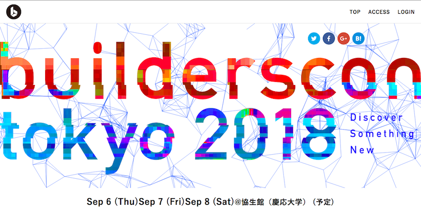
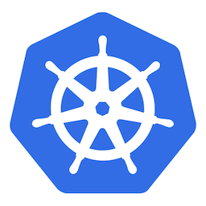
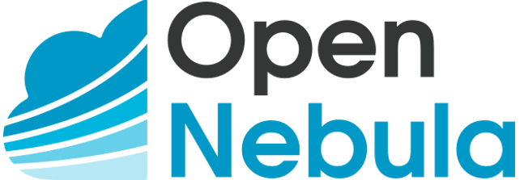

## 最近何してます？
### @nasa9084

---

### at first
#### this slide is:

https://gitpitch.com/nasa9084/slides/ngineexiv

---

## $ whoami

* @nasa9084
* 日本仮想化技術株式会社
  * (まだ)新卒一年目
* Go / Python
* 自宅k8s勢
* emacs! emacs! emacs!
* https://blog.web-apps.tech

+++

### builderscon

* https://builderscon.io/
* 2018/09/06 - 2018/09/08

+++

### `</advertisement>`

---

## 最近何してます?

---

### Go

+++

#### github.com/nasa9084/syg

* Signal-Function mapper
* シグナルが来たら所定のcallbackを呼ぶ

+++

#### github.com/nasa9084/go-totp

* TOTP Generator
* (多分)最もシンプル

+++

#### git-license

* gitサブコマンド
* `git license -u ${USER} ${LICENSE} > LICENSE`
* ライセンスファイルをサクッと作成
* https://github.com/nasa9084/git-license

+++

#### container-up

* コンテナのバージョンアップを簡単に
* `container-up ${CONTAINER}`
  * `docker-compose up`を単体Dockerでやりたかった
* https://github.com/nasa9084/container-up

---

### 自宅インフラ

+++

### My Home Infra

---

# `</slide>`
