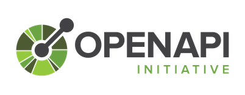
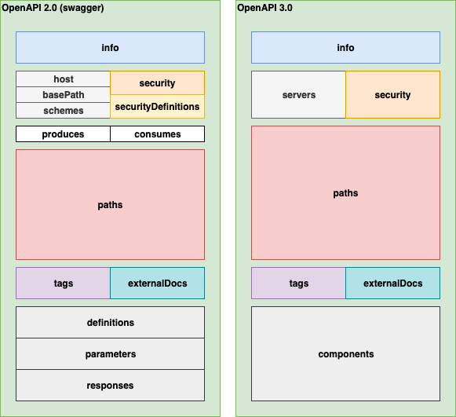

---?image=assets/line_go.png&size=auto 100vh

---

# Code Generation from OpenAPI specification

---

## $ whoami


* @nasa9084 @fa[twitter] @fa[github]
* emacs! emacs! emacs!
* Go / Kubernetes

+++

### self-made keyboards


+++

### builderscon


[builderscon.io](https://builderscon.io)

+++?image=assets/bibimpa.jpg

# <span style="color: white;">&lt;/advertise&gt;</span>

---

## Agenda

* What is OpenAPI Specification
* How do I generated codes
* Tips
* Explore my code generator

---

# OpenAPI Specification

+++

## OpenAPI Specification (OAS)



* ex. swagger (2.0)
* machine readable (JSON/YAML)
* a standard, programming language-agnostic interface description for REST APIs
* just text, can managed by SCM
* [github/oai](https://github.com/oai)

+++

### How to use?

* to generate document
* to generate client SDK
* to generate server skeleton
* to generate tests
* to generate mock server

+++

### Organized top level structure



---

## Libraries for Go

* [github/nasa9084/go-openapi](https://github.com/nasa9084/go-openapi)
* [github/wzshiming/openapi](https://github.com/wzshiming/openapi)
* [github/getkin/kin-openapi](https://github.com/getkin/kin-openapi)
* [github/lestrrat-go/openapi](https://github.com/lestrrat-go/openapi)
* [github/OpenAPITools/openapi-generator](https://github.com/OpenAPITools/openapi-generator)

@fa[exclamation-triangle] github/go-openapi has not support OAS 3.0

---

## How to Code Generation

* use AST
* use other LL (Perl, Python, Ruby...)
* use text/template
* use muscle

+++

### JUST USE MUSCLE
#### fmt.Fprintf

+++

### Pros

* just go code
* can use for, if, functions and so on
* text/template is difficult
* Go code can be formatted easily (use format.Source)

+++

### Cons

* toooo many fmt.Fprintf
* you may need to write fmt.Fprintf * Line of Code
* not easy to read...

---?image=assets/roast_don.jpg

# <span style="color: white;">Muscle CodeGen tips</span>

+++

### `internal` package

* since go1.5
* unexposed code outside repository
* code /a/b/c/internal/d/e/f can be imported only by code in the dir rooted at /a/b/c
* usable for **generator** codes

+++

### Sort

* sort your definitions (from map)
  * diff changed every codegen

``` go
var schemaNames []string
for name := range schemas {
    schemaNames = append(schemaNames, name)
}
sort.Strings(schemaNames)

for _, name := range schemaNames {
    schema := schemas[name]
    // generate your code using schema
}
```

+++

### line by line

* one fmt.Fprint for one line
  * you can easy to add a new line or condition

+++

### Newline

* add `\n` at first of line
  * you don't have to expect next line

``` go
fmt.Fprintf(w, "\n\nfunc YourFunction() {")
fmt.Fprintf(w, "\n// your code")
fmt.Fprintf(w, "\n}")
```

+++

### Format

* do not indent by yourself
  * you can use `format.Source`

``` go
var raw []byte // your generated code buffer
var f io.Writer // maybe output file
src, err := format.Source(raw)
if err != nil {
    // error
}
f.Write(src)

```

+++

### naming & comment

* you should add some prefix/suffix to filename
* you should add code generated comment into source
  * `^// Code generated .* DO NOT EDIT\.$` is std way

---

# Explore my code generator

---

# &lt;/slide&gt;

---

# Q?
