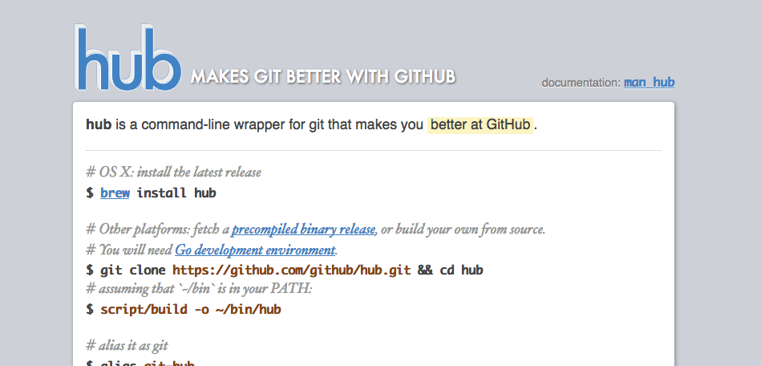
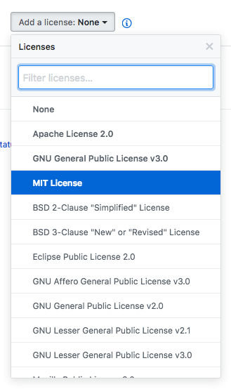
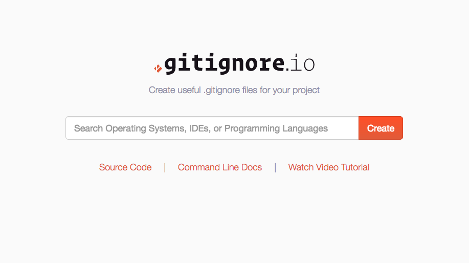

## Improving Command-Line Git Environments
### @nasa9084

---

## At First
### This Slide is:
https://gitpitch.com/nasa9084/slides/wakate2018w

---

## $ whoami


* @nasa9084
* VirtualTech Japan Inc.
* Go/Python
* emacs! emacs! emacs!

---

## GitHub with CLI
### `hub` command



+++

### Usage

- wraps `git` command
  + `alias git=hub`
- creates repository on GitHub:
  + `git create`
- makes a fork:
  + `git fork`
- makes a pull-request:
  + `git pull-request`

---

## Creating Repository on GitHub...

+++

### You can auto-make .gitignore/LICENSE


+++

### You can choose your product's license



---

## gitignore.io



+++

### gitignore.io API

web API to get .gitignore

`$ curl https://www.gitignore.io/api/LANGUAGE,OS,EDITOR,...`

#### e.g.

`$ curl https://www.gitignore.io/api/go,macos,emacs`

+++

### Git Command Alias

use `git config alias.xxx` to create command alias "`git xxx`"

+++

### Install gitignore.io to Command Line

``` shell
$ git config --global alias.ignore '!gi() { curl -L -s https://www.gitignore.io/api/$@ ;}; gi'
```

now you can use `git ignore foo,bar,baz,...`

---

### Git Subcommand

you can create your git subcommand easily

0. make your command
0. name the executable git-xxx
0. put it in your $PATH
0. now you can use `git xxx`

+++

### git-license

auto-make LICENSE file using GitHub API

#### installation

``` shell
$ go get github.com/nasa9084/git-license
```

or download from release page on GitHub into your $PATH

---

# `</present>`
