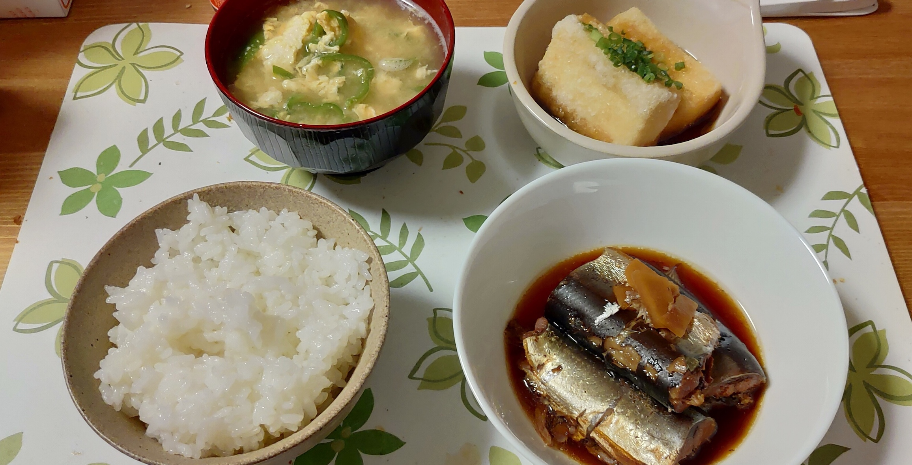

## 2018年に作ったもの
### [@nasa9084](https://twitter.com/nasa9084)

---

## $ whoami

* @nasa9084 @fa[twitter] @fa[github]
* LINE Corp.
* Go, emacs, Kubernetes

---

# 2018年に作ったもの

---

## 1. 漬サーモン丼

+++

## 2. ベーコンとジャガイモのキッシュ

+++

## 3. おからハンバーグとおからメンチ

+++

## 4. 親子丼

+++

## 5. アヒージョ

+++

## 6. ローストビーフ丼

+++

### ANOVA

+++

## 7. 超級カツ丼

+++

## 8. ファイナルカツカレー

+++

## 9. 骨サンマ

+++

## 10. エビチリ

+++

## 11. 唐揚げ

+++

## 12. 鮭いくら丼

+++

## 13. マルゲリータ

+++

## 14. カルボナーラ

+++

## 15. カマンベールチーズ蜂蜜がけ

---

#### CODE

* [`github.com/nasa9084/go-errwriter`](https://github.com/nasa9084/go-errwriter)
* [`github.com/nasa9084/redmine-issue-slack`](https://github.com/nasa9084/redmine-issue-slack)
* [`github.com/nasa9084/redmine-issue-summary`](https://github.com/nasa9084/redmine-issue-summary)
* [`github.com/nasa9084/go-totp`](https://github.com/nasa9084/go-totp)
* [`github.com/nasa9084/go-openapi`](https://github.com/nasa9084/go-openapi)
* [`github.com/nasa9084/go-secret`](https://github.com/nasa9084/go-secret)

+++

#### SLIDES

* [だいたい新卒vol.14](https://gitpitch.com/nasa9084/slides/ngineerxiv_vol14)
* [OOL Forum 2018](https://gitpitch.com/nasa9084/slides/oolforum2018)
* [db analytics showcase 2018](https://gitpitch.com/nasa9084/slides/dbas2018)
* [OSC 2018 Hokkaido](https://gitpitch.com/nasa9084/slides/osc18do)
* [OSC 2018 Kyoto](https://gitpitch.com/nasa9084/slides/osc18kyoto)
* [builderscon tokyo 2018](https://gitpitch.com/nasa9084/slides/builderscon18)
* [Rancher Meetup Tokyo #15](https://gitpitch.com/nasa9084/slides/rancherjp15)
* [だいたい新卒 vol.17](https://gitpitch.com/nasa9084/slides/ngineerxiv_vol17)

---

# Q?
