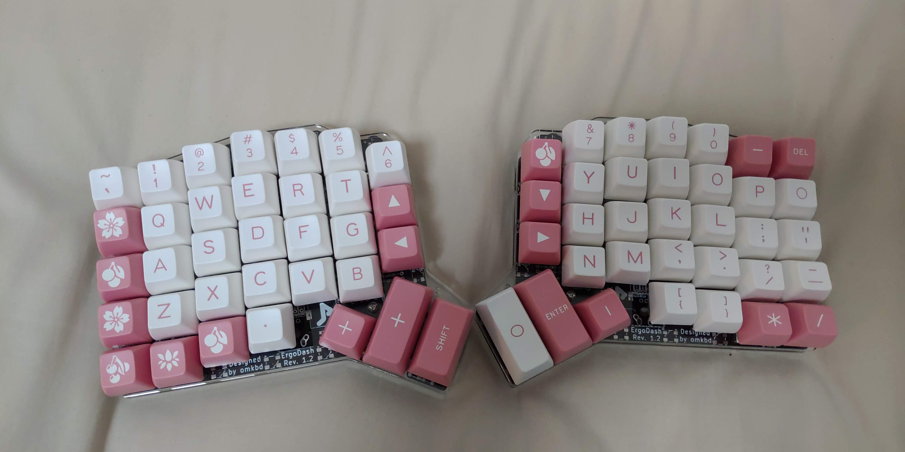

# API Server Codegen from OpenAPI specification

---

## $ whoami

* @nasa9084 @fa[twitter] @fa[github]
* emacs! emacs! emacs!
* Go / Kubernetes

+++

### self-made keyboards

---

# Open API Specification

+++

## Open API Specification (OAS)

* ex. swagger (2.0)
* JSON / YAML
* a standard, programming language-agnostic interface description for REST APIs

+++

### Organized top level structure

---

## Libraries for Go

* [github/nasa9084/go-openapi](https://github.com/nasa9084/go-openapi)
* [github/wzshiming/openapi](https://github.com/wzshiming/openapi)
* [github/getkin/kin-openapi](https://github.com/getkin/kin-openapi)
* [github/lestrrat-go/openapi](https://github.com/lestrrat-go/openapi)

@fa[exclamation-triangle] github/go-openapi has not support OAS 3.0

---

# Q?
