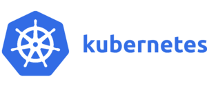

## 入門Kubernetes
### @nasa9084

---

### AT FIRST

This slide:

https://gitpitch.com/nasa9084/slides/osc18kyoto

---

### $ whoami

* @nasa9084
* VirtualTech Japan Inc.
* on-home K8s-er
* Go/Python

+++

#### myhome k8s

---

### WHAT IS Kubernetes?

+++

#### Kubernetes (K8s)

* /k(j)uːbəˈnɛtɪs/, /k(j)uːbəˈneɪtɪs/
* distributed container orchestration system
  * infrastructure for containerized applications
  * microservice architecture
  * container node clustering
  * autonomous system
  * immutable infrastructure
  * declarative
* **abstraction environment**

---

#### ADVANTAGES of Kubernetes

* abstract infrastructure
* force Infrastructure as Code
* self-healing
* service discovery
* automated rollout & rollback
* automated horizontal scale

---

# Q?
