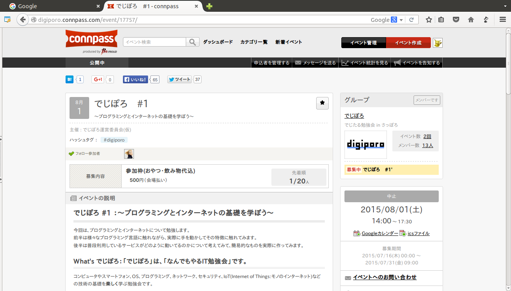

# 開催の理由

----

### 札幌、北海道で行われている勉強会
* Python札幌
* CTF勉強会
* せきゅぽろ
* C++勉強会

----

### でも・・・

----

### 初心者向け勉強会がない！

----

### というわけで

作っちゃいました。

* 初心者じゃないヒトには常識に近い内容かも

# #1'?

----

### なぜ#1ではないのか？

* 2015/8/1
* 参加者が1名しかいない・・

----

### 今日の内容
* Introduction of Programming Languages
    * nasa9084
* プログラミングができるようになる考え方
    * まあず
* インターネットとクラウドの世界
    * こばやし

* プログラミング言語の紹介
* プログラミングができるようになる考え方
* クラウド時代のインターネットを支える技術の紹介

